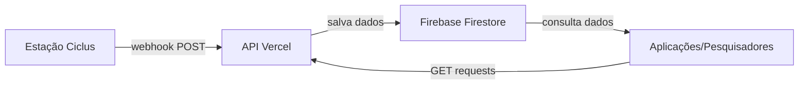

# 🌦️ API Meteorológica Ciclus - UEMA

> API intermediária para captura e disponibilização de dados meteorológicos da estação Ciclus instalada na Universidade Estadual do Maranhão (UEMA).

[](https://agronomia-5jelpsqru-murillous-projects.vercel.app)
[](https://nodejs.org/)
[](https://firebase.google.com/)
[](https://expressjs.com/)

## 📖 Sobre o Projeto

Esta API foi desenvolvida pela **Thera Academic Software House** do curso de **Engenharia da Computação da UEMA**, a pedido da **diretoria do curso de Engenharia Agronômica** para democratizar o acesso aos dados meteorológicos coletados pela estação Ciclus instalada no campus.

### 👨‍💻 **Desenvolvimento**

- **Laboratório**: Thera Academic Software House - Engenharia da Computação
- **Curso**: Engenharia da Computação - UEMA
- **Desenvolvedor Responsável**: Sérgio Murilo Castelhano
- **Solicitante**: Diretoria do curso de Engenharia Agronômica - UEMA

### 🎯 Objetivo

Tornar os dados meteorológicos **mais acessíveis e públicos**, eliminando a necessidade de login na plataforma proprietária da estação Ciclus. A API recebe dados via webhook e os disponibiliza através de endpoints RESTful simples.

### 🏛️ Contexto Acadêmico

- **Instituição**: Universidade Estadual do Maranhão (UEMA)
- **Desenvolvido por**: Thera Academic Software House - Engenharia da Computação
- **Solicitado por**: Coordenação de Engenharia Agronômica
- **Aplicação**: Pesquisa agrícola, estudos climáticos, projetos acadêmicos
- **Beneficiários**: Estudantes, professores, pesquisadores e comunidade

## 🏗️ Arquitetura do Sistema



### 📊 Fluxo de Dados

1. **Coleta**: Estação Ciclus coleta dados meteorológicos a cada 10 minutos
2. **Envio**: Dados são enviados via webhook POST para nossa API
3. **Validação**: API valida e padroniza os dados recebidos
4. **Armazenamento**: Dados são salvos no Firebase Firestore
5. **Disponibilização**: Dados ficam disponíveis via endpoints públicos GET

## 🌡️ Dados Meteorológicos Coletados

A estação Ciclus coleta os seguintes parâmetros:

### 🌤️ **Dados Atmosféricos**

- **Temperatura Externa** (°C)
- **Umidade Relativa do Ar** (%)
- **Pressão Atmosférica** (hPa)
- **Radiação Solar** (W/m²)

### 🌧️ **Dados Pluviométricos**

- **Pluviosidade Horária** (mm)
- **Pluviosidade Diária Acumulada** (mm)

### 💨 **Dados de Vento**

- **Velocidade Média** (m/s)
- **Velocidade Máxima** (m/s)
- **Direção** (graus 0-360)

### 🌱 **Dados de Solo** (até 3 profundidades)

- **Umidade do Solo** (%)
- **Temperatura do Solo** (°C)

### 🍃 **Dados Foliares**

- **Umidade Foliar** (%)
- **Temperatura Foliar** (°C)

### 🏭 **Qualidade do Ar**

- **Material Particulado PM1.0** (μg/m³)
- **Material Particulado PM2.5** (μg/m³)
- **Material Particulado PM10** (μg/m³)

## 🚀 API Endpoints

### 📍 **Base URL**

```
https://agronomia-5jelpsqru-murillous-projects.vercel.app
```

### 🔍 **Endpoints Públicos**

#### **Status da API**

```http
GET /api/health
```

Verifica se a API está funcionando e conectada ao banco de dados.

**Resposta:**

```json
{
  "status": "OK",
  "timestamp": "2025-01-25T10:30:00.000Z",
  "service": "Ciclus Weather API",
  "version": "1.1.0",
  "firebase": "connected",
  "environment": "production"
}
```

#### **Dados Mais Recentes**

```http
GET /api/weather/latest?limit=20
```

Retorna os dados meteorológicos mais recentes.

**Parâmetros:**

- `limit` (opcional): Número de registros (1-100, padrão: 20)

**Resposta:**

```json
{
  "success": true,
  "count": 20,
  "limit": 20,
  "data": [
    {
      "id": "doc123",
      "Temperatura": 27.16,
      "Umidade": 41.34,
      "Pressao": 1036.82,
      "PluviometroH": 0,
      "PluviometroD": 0,
      "VelocidadeMedia": 0,
      "VelocidadeMax": 0,
      "DirecaoVento": 180,
      "UmidadeSolo": 25.4,
      "TemperaturaSolo": 22.1,
      "Solarizacao": 296,
      "IdEstacao": 1738279507,
      "ts": "1746466087000",
      "receivedAt": "2025-01-25T10:30:00.000Z"
    }
  ]
}
```

#### **Dados por Período**

```http
GET /api/weather/period?start=1746466087000&end=1746552487000&limit=100
```

Retorna dados meteorológicos de um período específico.

**Parâmetros:**

- `start` (obrigatório): Timestamp inicial em milissegundos
- `end` (obrigatório): Timestamp final em milissegundos
- `limit` (opcional): Número de registros (1-1000, padrão: 100)

**Exemplo de uso:**

```bash
# Dados das últimas 24 horas
curl "https://agronomia-5jelpsqru-murillous-projects.vercel.app/api/weather/period?start=1746379687000&end=1746466087000"
```

### 🔐 **Endpoint Protegido**

#### **Webhook da Estação Ciclus**

```http
POST /api/webhook/weather
Headers:
  x-api-key: [UUID-SECRETO]
  Content-Type: application/json
```

Endpoint para recebimento de dados da estação meteorológica (uso interno).

## 💻 Exemplos de Uso

### **JavaScript/Node.js**

```javascript
// Buscar dados mais recentes
const response = await fetch(
  "https://agronomia-5jelpsqru-murillous-projects.vercel.app/api/weather/latest?limit=10"
);
const data = await response.json();

console.log(`Temperatura atual: ${data.data[0].Temperatura}°C`);
console.log(`Umidade: ${data.data[0].Umidade}%`);
```

### **cURL**

```bash
# Status da API
curl https://agronomia-5jelpsqru-murillous-projects.vercel.app/api/health

# Dados mais recentes
curl "https://agronomia-5jelpsqru-murillous-projects.vercel.app/api/weather/latest?limit=5"

# Dados do último mês
curl "https://agronomia-5jelpsqru-murillous-projects.vercel.app/api/weather/period?start=1743787687000&end=1746466087000&limit=1000"
```

## 🛠️ Tecnologias Utilizadas

- **Backend**: Node.js + Express.js
- **Banco de Dados**: Firebase Firestore
- **Deploy**: Vercel (Serverless)
- **Autenticação**: UUID via header x-api-key
- **Validação**: Sistema customizado tolerante a falhas de sensores

### 📦 Dependências Principais

```json
{
  "cors": "^2.8.5",
  "dotenv": "^17.2.2",
  "express": "^5.1.0",
  "firebase-admin": "^13.5.0"
}
```

## 🔧 Configuração Local (Para Desenvolvedores)

### **1. Pré-requisitos**

- Node.js 18.x ou superior
- Conta Firebase com projeto configurado
- Vercel CLI (opcional, para deploy)

### **2. Instalação**

```bash
git clone https://github.com/murillous/agronomia-API
cd agronomia-API
npm install
```

### **3. Configuração**

```bash
cp .env.example .env
# Edite o .env com suas credenciais
```

### **4. Execução**

```bash
# Desenvolvimento
npm run dev

# Produção local
npm start
```

### **5. Teste**

```bash
curl http://localhost:3000/api/health
```

## 📊 Estrutura do Banco de Dados

### **Coleção: `weather_data`**

```json
{
  "id": "documento-id-auto-gerado",
  "Temperatura": 27.16,
  "Umidade": 41.34,
  "PluviometroH": 0,
  "PluviometroD": 0,
  "Pressao": 1036.82,
  "VelocidadeMedia": 0,
  "VelocidadeMax": 0,
  "DirecaoVento": 180,
  "UmidadeSolo": 25.4,
  "TemperaturaSolo": 22.1,
  "UmidadeSolo_2": 28.3,
  "TemperaturaSolo_2": 21.7,
  "UmidadeSolo_3": 30.1,
  "TemperaturaSolo_3": 23.0,
  "UmidadeFolear": 45.8,
  "TemperaturaFolear": 24.2,
  "Solarizacao": 296,
  "pmc10": 12.5,
  "pmc25": 8.9,
  "pmc100": 4.3,
  "RSSI": 0,
  "Bateria": 50,
  "Boot": 221,
  "VersaoSw": "3.1.0",
  "VersaoPcb": "REV9",
  "MacId": 3.6,
  "TemperaturaInterna": 36.4,
  "IdEstacao": 1738279507,
  "ts": "1746466087000",
  "receivedAt": "2025-01-25T10:30:00.000Z",
  "processedAt": "Firebase Server Timestamp",
  "apiVersion": "1.1.0"
}
```

## 🛡️ Segurança e Validação

### **Validação Inteligente**

A API implementa validação tolerante a falhas, onde:

- ✅ **Campos críticos** são obrigatórios (`IdEstacao`, `ts`)
- ✅ **Pelo menos um sensor** deve estar funcionando
- ⚠️ **Sensores individuais** podem falhar sem rejeitar os dados
- 🧹 **Limpeza automática** padroniza tipos e formatos

### **Autenticação**

- Webhook protegido por UUID via header `x-api-key`
- Endpoints de consulta são públicos (somente leitura)
- Logs de tentativas de acesso não autorizado

## 📈 Monitoramento

### **Health Check**

- Endpoint `/api/health` para monitoramento
- Verifica conectividade com Firebase
- Informações de versão e ambiente

### **Logs**

- Logs estruturados de todas as operações
- Registro de dados recebidos e processados
- Alertas de sensores com problemas

## 🤝 Contribuições Acadêmicas

Este projeto foi desenvolvido para apoiar:

- 📚 **Pesquisas acadêmicas** em climatologia agrícola
- 🌱 **Projetos de extensão** relacionados ao clima
- 📊 **Análises estatísticas** de dados meteorológicos
- 🎓 **Trabalhos de conclusão** em Engenharia Agronômica

## 📞 Suporte e Contato

### **Para Pesquisadores/Estudantes da UEMA:**

- 📧 Email institucional da coordenação do curso
- 🏛️ Coordenação de Engenharia Agronômica - UEMA

### **Para Desenvolvedores:**

- 🐛 Issues: [GitHub Issues](https://github.com/murillous/agronomia-API/issues)
- 🚀 Features: Pull requests são bem-vindos

### **Desenvolvimento:**

- 🔬 **Laboratório Thera** - Laboratório de Desenvolvimento de Sistemas
- 👨‍💻 **Responsável**: Sérgio Murilo Castelhano
- 🏛️ **Curso**: Engenharia da Computação - UEMA

## 📄 Licença

Este projeto está licenciado sob a **MIT License** - veja o arquivo [LICENSE](LICENSE) para detalhes.

### MIT License - Resumo

- ✅ Uso comercial permitido
- ✅ Modificação permitida
- ✅ Distribuição permitida
- ✅ Uso privado permitido
- ⚠️ Sem garantia
- 📋 Deve incluir a licença e copyright

---

<div align="center">

**🌱 Desenvolvido pelo Laboratório Thera - UEMA**

_Democratizando o acesso a dados meteorológicos para pesquisa e educação_

[](https://www.uema.br/)
[](https://www.uema.br/)

**Desenvolvido por: Sérgio Murilo Castelhano**  
_Thera Academic Software House_  
_Engenharia da Computação - UEMA_

</div>
